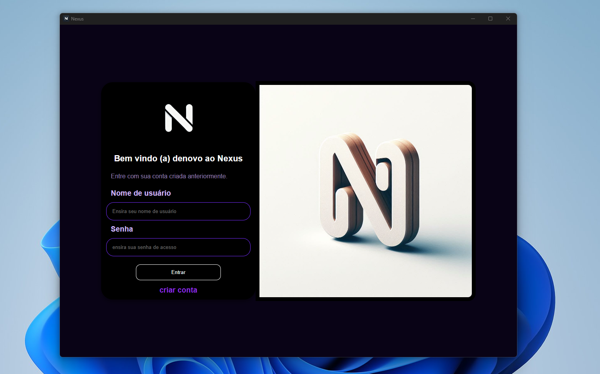
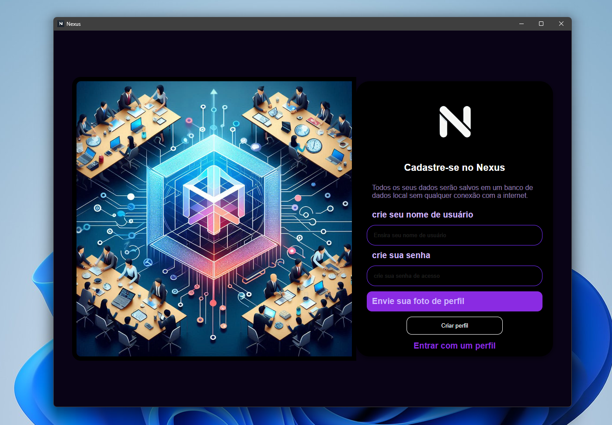
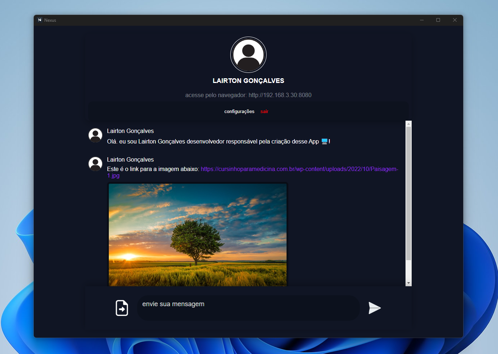

# Projeto Nexus

Nexus é um aplicativo de mensagens instantâneas multimídia que permite a comunicação local em tempo real sem a necessidade de internet. Desenvolvido para oferecer uma experiência offline, o Nexus combina simplicidade e funcionalidade em sua interface intuitiva.

## Principais Funcionalidades
- Envio de mensagens de texto, links e imagens.
- Comunicação em tempo real sem internet.
- Interface simples e personalizável com opções de configuração de layout.
- Alteração de dados do usuário.

## Tecnologias Utilizadas
- **Back-end:** Node.js, Express, Socket.IO, SQLite3
- **Front-end:** HTML5, CSS3, JavaScript e Electron.JS.

## Estrutura do Projeto
```plaintext
App Nexus/
│   ├── server.js            # Configuração principal do servidor com rotas e banco de dados.
|   ├── main.js             # Configuração do Electron, exibição de interface e execução do server.js.
├── frontend/              # Arquivos do cliente
│   ├── icons/            # Ícones do aplicativo
|   ├── uploads/          # Pasta para armazenar imagens e fotos de perfil enviados pelo chat e na criação de perfil
│   ├── index.html         # Página de login.
|   ├── cadastro.html      # Página de cadastro.
|   ├── chat.html          # Página principal do chat.
|   ├── nexus-chat-.css    # estilo CSS da página principal do chat;
|   └── nexus-style.css    # estilo CSS das páginas de login e cadastro.
├── database/              # Pasta onde serão criado os banco de dados quando o app for executado.
├── imgs_projeto/          # Imagens do projeto para documentação
└── README.md              # Documentação do projeto
```

## Como Executar o Projeto?
Faça o download do arquivo instalador **Nexus Setup v1.0.0.exe** e abra o app que começará a ser executado e funcionando.

## Imagens do Projeto
### Tela de Login


### Tela de Cadastro


### Tela do Chat Principal


## Contribuição
Contribuições são bem-vindas! Siga os passos abaixo para contribuir:
1. Faça um fork do projeto.
2. Crie uma branch para suas alterações:
   ```bash
   git checkout -b minha-nova-feature
   ```
3. Commit suas alterações:
   ```bash
   git commit -m 'Minha nova feature'
   ```
4. Envie para o repositório remoto:
   ```bash
   git push origin minha-nova-feature
   ```
5. Abra um pull request.

## Licença
Este projeto está licenciado sob a Licença GNU General Public License v3.0. Consulte o arquivo `LICENSE` para mais informações.

---
**Desenvolvido por Lairton Gonçalves.**

